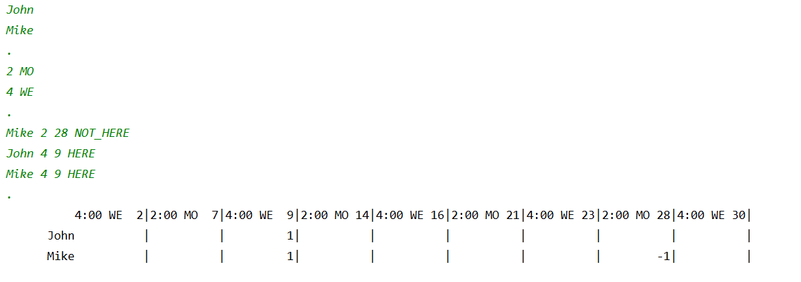

# Day 00 – Java bootcamp
### Управляющие структуры и массивы

*_Сегодня вы изучите основы решения как простых, так и более сложных бизнес-задач с использованием базовых конструкций языка Java._*


# Часть I
### Общие правила

-   Использование определяемых пользователем методов и классов запрещено для всех задач дня, за исключением определяемых пользователем статических функций и процедур в основном файле класса решения.

-   Все задания содержат список ДОПУСТИМЫХ языковых конструкций для конкретного задания.

-   Для всех задач можно использовать System::exit.

-   Все задания содержат пример работы приложения. Реализованное решение должно быть идентично указанному примеру вывода для текущих входных данных.

-   Для наглядности данные, введенные пользователем в примерах заданий, предваряются стрелкой (->). Не учитывайте эти стрелки при реализации решения!


P.S. Некоторые задачи требуют нетривиального подхода из-за вышеупомянутых ограничений. Эти ограничения научат вас находить решения для автоматизации реальных бизнес-процессов.

# Часть II
### Exercise 00 – Сумма цифр

|||  
|------|------|  
| **Allowed** | |  
| Input/Output | System.out|  
| Types |   Primitive types |  
| Operators |   Standard operations of primitive types|  

Вычислите сумму цифр шестизначного целого числа (значение числа задается непосредственно в коде путем явной инициализации числовой переменной).

Пример выполнения программы для числа 479598:
```  
$ java Program  
 42
 ```  

# Часть III
### Exercise 01 – Простые числа

|||  
|------|------|  
| **Allowed** | |  
|Input/Output   | System.out, System.err, Scanner(System.in) |  
| Types |   Primitive types |  
| Operators |   Standard operations of primitive types, conditions, loops |  


Согласно теореме Бёма-Якопини, любой алгоритм можно записать, используя три утверждения: последовательность, выбор и итерация.

Используя эти операторы в Java, вам нужно определить, является ли входное число простым. Простое число — это число, которое делится только на 1 и не делится ни на что другое.

Программа принимает число, введенное с клавиатуры, и отображает результат проверки на простоту этого числа. Кроме того, программа должна выводить количество шагов (итераций), необходимых для выполнения проверки. В данной задаче итерация представляет собой одну операцию сравнения.

Для отрицательных чисел, 0 и 1, выведите сообщение IllegalArgument и завершите программу с кодом -1.

Пример работы программы:

```  
$ java Program  
-> 169  
 false 12  
$ java Program  
-> 113  
 true 10  
$ java Program  
-> 42  
 false 1  
$ java Program  
-> -100   
   Illegal Argument  
```  

# Часть IV
### Exercise 02 – Бесконечная последовательность (или нет?)

||| 
|------|------|  
| **Allowed** | |  
Input/Output |  System.out, System.err, Scanner(System.in)  
Types | Primitive types  
Operators | Standard operations of primitive types, conditions, loops  


Сегодня вы — Google. Вам нужно подсчитать количество запросов, связанных с приготовлением кофе, которые пользователи нашей поисковой системы делают в определенный момент. Понятно, что последовательность поисковых запросов бесконечна. Невозможно сохранить эти запросы и подсчитать их позже.

Но есть решение — обрабатывать поток запросов. Зачем тратить ресурсы на все запросы, если нас интересует только конкретная характеристика этой последовательности запросов? Предположим, что каждый запрос — это любое натуральное число, кроме 0 и 1. Запрос связан с приготовлением кофе только в том случае, если сумма цифр этого числа (запроса) является простым числом.

Итак, нам нужно реализовать программу, которая будет подсчитывать количество элементов для заданного набора чисел, сумма цифр которых является простым числом. Для простоты предположим, что эта потенциально бесконечная последовательность запросов все еще ограничена, и последний элемент последовательности равен 42.

Эта задача гарантирует абсолютную корректность входных данных.

Пример работы программы:

```  
$ java Program  
-> 198131  
-> 12901212  
-> 11122  
-> 42  
 Count of coffee-request – 2
 ```  

# Часть V
### Exercise 03 – Немного статистики
|||
---|---  
| **Allowed** | |  
Input/Output | System.out, System.err, Scanner(System.in)  
Types | Primitive types, String  
Operators   | Standard operations of primitive types, conditions, loops  
Methods |   String::equals  


При разработке корпоративных систем часто возникает необходимость сбора различной статистики. И заказчик всегда хочет, чтобы такая аналитика была наглядной. Кому нужны сухие, безжизненные цифры?

К этой категории клиентов часто относятся образовательные организации и онлайн-школы. Теперь вам необходимо реализовать функциональность для визуализации прогресса учащихся. Клиент хочет видеть диаграмму, показывающую изменения в прогрессе ученика за несколько недель.

Клиент оценивает этот прогресс, выставляя минимальную оценку за пять тестов в течение каждой недели. Каждый тест может быть оценен по шкале от 1 до 9.

Максимальное количество недель для анализа — 18. После получения информации за каждую неделю программа отображает график в консоли, показывающий минимальные оценки за конкретную неделю.

И мы продолжаем исходить из предположения, что 42 — это предельный размер входных данных.

Гарантированное количество тестов в неделю составляет 5.

Однако порядок ввода еженедельных данных не гарантируется, поэтому данные за 1-ю неделю могут быть введены после данных за 2-ю неделю. Если порядок ввода данных неверен, отобразится сообщение IllegalArgument, и программа будет завершена с кодом -1.

**Примечание** :

1.  Существует множество вариантов хранения информации, и массивы — лишь один из них. Рассмотрим другой метод хранения данных о результатах студенческих тестов без использования массивов.
2.  Конкатенация строк часто приводит к неожиданному поведению программы. Если в цикле для одной переменной выполняется много итераций операции конкатенации, приложение может значительно замедлиться. Именно поэтому не следует использовать конкатенацию строк внутри цикла для получения результата.

Пример работы программы:

```  
$ java Program  
-> Week 1  
-> 4 5 2 4 2  
-> Week 2  
-> 7 7 7 7 6  
-> Week 3  
-> 4 3 4 9 8  
-> Week 4  
-> 9 9 4 6 7  
-> 42  
Week 1 ==>  
Week 2 ======>  
Week 3 ===>  
Week 4 ====>  
```  

# Часть VI
### Exercise 04 – A Bit More of Statistics
||| 
---|---  
| **Allowed** | |  
Input/Output |  System.out, System.err, Scanner(System.in)  
Types | Primitive types, String, arrays  
Operators   | Standard operations of primitive types, conditions, loops  
Methods | String::equals, String::toCharArray, String::length  


А вы знали, что частотный анализ можно использовать для расшифровки плохо зашифрованных текстов?

См. [https://en.wikipedia.org/wiki/Frequency_analysis](https://en.wikipedia.org/wiki/Frequency_analysis)

Почувствуйте себя хакером и создайте программу для подсчета количества вхождений символа в тексте.

Нам важна наглядная визуализация. Поэтому программа отобразит результаты в виде гистограммы. На этом графике будут показаны 10 наиболее часто встречающихся символов в порядке убывания частоты.

Если буквы встречаются одинаковое количество раз, их следует расположить в лексикографическом порядке.

Каждый символ может встречаться в тексте очень много раз. Поэтому диаграмма должна быть масштабируемой. Максимальная высота отображаемой диаграммы составляет 10, а минимальная — 0.

Входными данными для программы является строка с одним символом "\n" в конце (таким образом, в качестве входных данных может использоваться одна длинная строка).

Предполагается, что каждый входной символ может содержаться в символьной переменной (Unicode BMP; например, код буквы "S" равен 0053, максимальное значение кода — 65535).

Максимальное количество вхождений символов составляет 999.

**Примечание** : эту проблему необходимо решить без многократных итераций по исходному тексту (сортировки и удаления повторений), поскольку эти методы значительно замедлят работу приложения. Используйте другие методы обработки информации.

Пример работы программы:

```  
$ java Program  

-> AAAAAAAAAAAAAAAAAAAAAAAAAAAAAAAASSSSSSSSSSSSSSSSSSSSSSSSDDDDDDDDDDDDDDDDDDDDDDDDDDDDDDDDDWEWWKFKKDKKDSKAKLSLDKSKALLLLLLLLLLRTRTETWTWWWWWWWWWWOOOOOOO42

 36
  #  35
  #   #
  #   #  27
  #   #   #
  #   #   #
  #   #   #
  #   #   #  14  12
  #   #   #   #   #   9
  #   #   #   #   #   #   7   4
  #   #   #   #   #   #   #   #   2   2
  D   A   S   W   L   K   O   T   E   R
 ```

# Часть VII
### Exercise 05 – Расписание

|||
---|---  
| **Allowed** | |  
Input/Output | System.out, System.err, Scanner(System.in)  
Types | Primitive types, String, arrays  
Operators   | Standard operations of primitive types, conditions, loops  
Methods |   String::equals, String::toCharArray, String::length  


Вы только что стали отличным хакером, но ваш клиент обращается к вам с новой задачей. На этот раз им нужно обеспечить ведение расписания занятий в своем учебном заведении. Клиент открывает школу в сентябре 2020 года. Поэтому вам нужно реализовать MVP-версию проекта только на этот месяц.

Вам необходимо уметь создавать список студентов и указывать время и дни недели для занятий. Занятия могут проводиться в любой день недели с 13:00 до 18:00. В один день может проводиться несколько занятий. Однако общее количество занятий в неделю не может превышать 10.

Максимальное количество студентов в расписании также составляет 10. Максимальная длина имени студента — 10 символов (без пробелов).

Также необходимо предусмотреть возможность регистрации посещаемости студентов. Для этого рядом с именем каждого студента следует указывать время и дату занятий, а также статус посещаемости (ЗДЕСЬ, НЕ_ЗДЕСЬ). Регистрировать посещаемость всех занятий в течение месяца не требуется.

Таким образом, жизненный цикл приложения выглядит следующим образом:

1.  Составление списка студентов
2.  Заполнение расписания — каждый урок (время, день недели) вносится в отдельную строку.
3.  Регистрация посещаемости
4.  Отображение расписания в табличной форме со статусами посещаемости.

Каждый этап работы приложения разделяется точкой (.). Абсолютная корректность данных гарантируется, за исключением последовательного упорядочивания занятий при заполнении расписания.

Пример работы программы:


